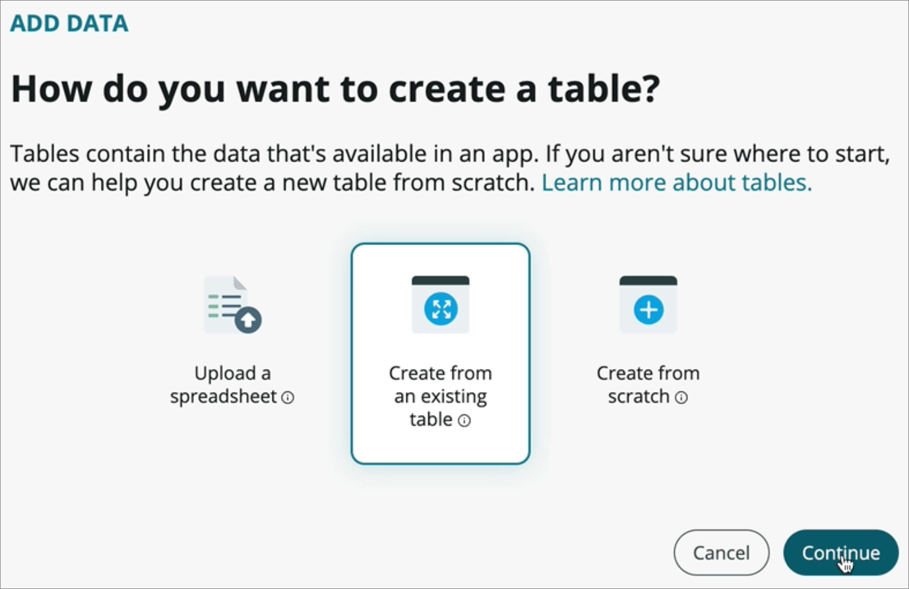
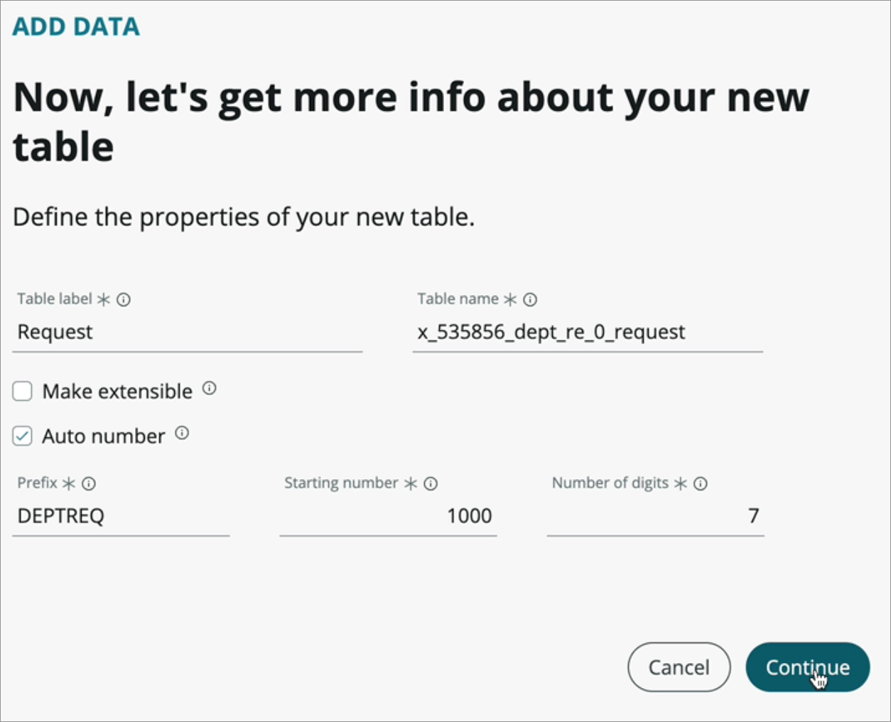
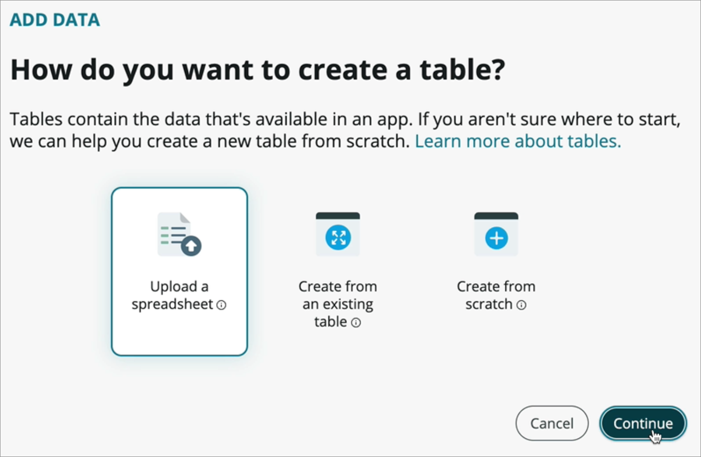
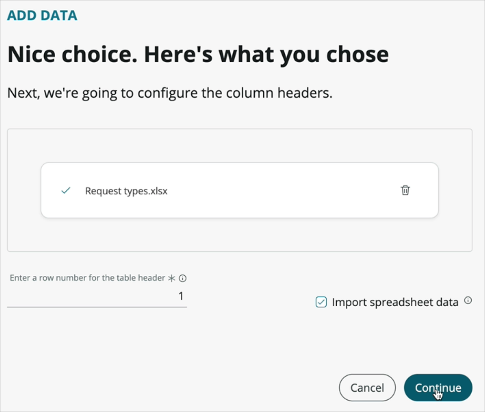
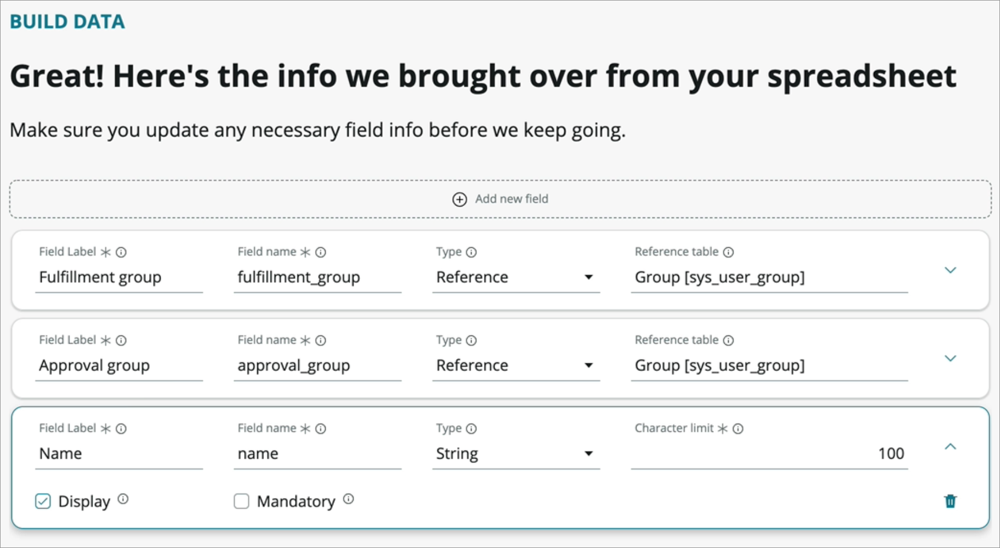
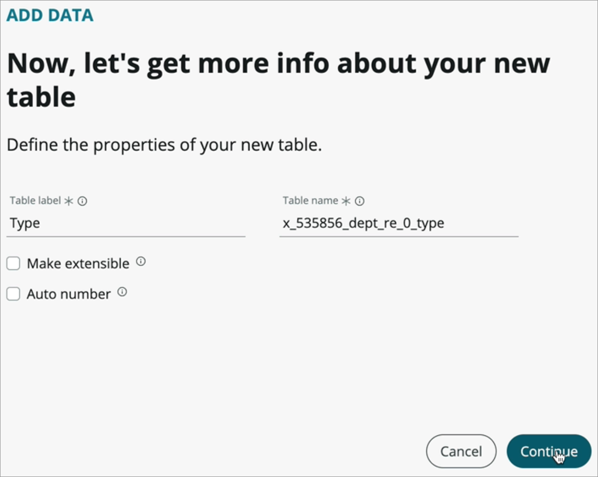
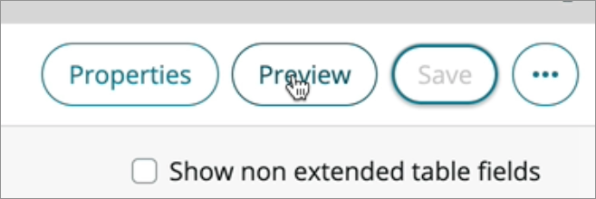
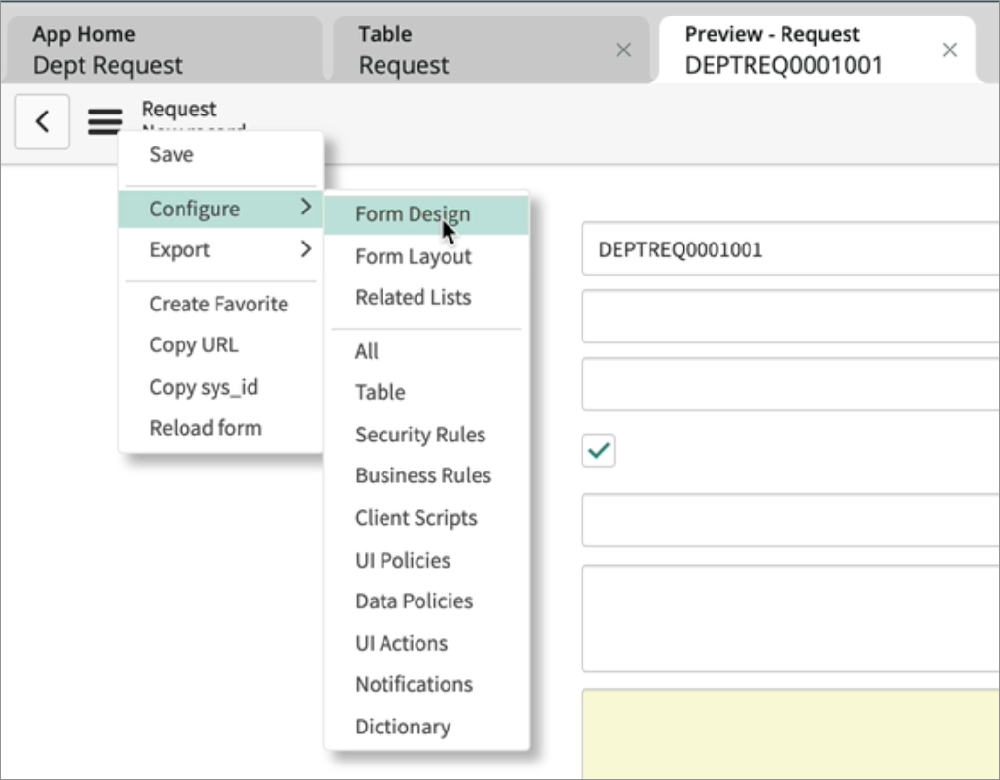
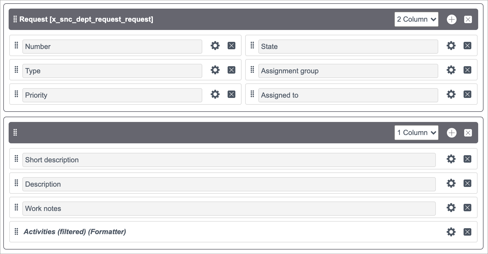

## Exercise 2 - Create a Data Model

In this exercise, you will create two tables, add fields, and configure the forms.

### Create a Request table

1. Open the Add data screen by click **+Add** or **+ Add a table or upload a spreadsheet** in the *Data* section.

    

1. Select the **Create from an existing table** option and then click **Continue**.

    

1. In the **Table** reference list, choose **Task [task]**.

    > Note that this type of field supports typeahead.

    

1. Click **Continue**.

1. In the form that comes up, configure the table properties.

    * _Table label_: **Request**
    * _Auto number_: **true** (clicking this will bring up the following options)
    * _Prefix_: **DEPTREQ**

    

1. Click **Continue**.

1. Click **Done** to go back to the app home screen.

### Create a Request type table from a spreadsheet

1. Open the Add data screen by clicking **+Add** or **+ Add a table or upload a spreadsheet** in the **Data** section.

1. Choose the **Upload a spreadsheet** option and then click **Continue**.

    

1. Download [this spreadsheet](assets/requesttypes.xlsx) and then upload it in this step.

1. Check the **Import spreadsheet data** checkbox.

    

1. Click **Continue**.

1. It will have created 3 columns. Change the _Fulfilment group_ field as follows:

    * _Name_: **Fulfillment group**
    * _Field name_: **fulfillment_group**
    * _Type_: **Reference**
    * _Reference table_: **Group [sys_user_group]**

1. Change the _Approval group_ field as follows:

    * _Name_: **Approval group**
    * _Field name_: **approval_group**
    * _Type_: **Reference**
    * _Reference table_: **Group [sys_user_group]**

1. Change the _Name_ field as follows:

    * _Name_: **Name**
    * _Field name_: **name**
    * _Type_: **String**
    * _Character limit_: **100**
    (click the down arrow to show more fields)
    * _Display_: **true**

    

1. Click **Continue**.

1. In the form that comes up, configure some of the table properties.

    * _Table label_: **Type**

    

1. Click **Continue**.

1. Click **Done** to return to the App Home screen.

### Configure the request table

1. Back at the App Home screen, click on the three horizontal dots menu in the Request table row and click **Edit**.

    

1. Click **+ Add new field** to add a new row to the table.

1. Fill out the row:

    * _Column label_: **Type**
    * _Type_: **Reference**
    * _Reference_: **Type** (the type table you created in the last section)

    

1. Click **Save**.

1. Click **Preview** to open the list view of the table in a new tab.

    

1. Click **New** to open the form view of the request table.

1. Click on the hamburger or three horizontal lines icon at the top left and go to **Configure > Form Design** to open the Form Designer. This will open in a new browser tab.

    

1. Use the X icon next to each of the following fields to remove them from the form:

    * Configuration item
    * Active
    * Parent

1. Drag the **Type** field from the list of fields on the left to go under the _Number_ field in the left column of the form.

1. Drag the **Priority** field from the right column to the left column to go under the _Type_ field.

1. Drag the **Assignment group** field from the fields list to the right column under _State_.

1. Drag the **Assigned to** field from the left column to the right column under _Assignment group_.

1. Lastly, drag the **Activities (filtered)** formatter from the left pane under formatters to the 1 column section under Work notes. Your form should look like this:

    

1. Click **Save** and close the form designer tab.

[Proceed to Exercise 3 - Create the Experiences](Exercise3-Experience.md)